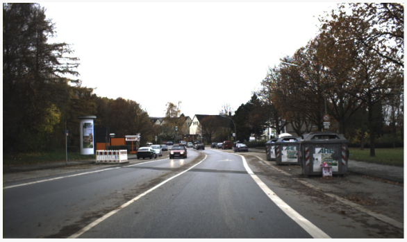
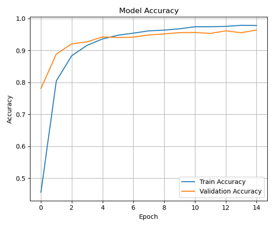
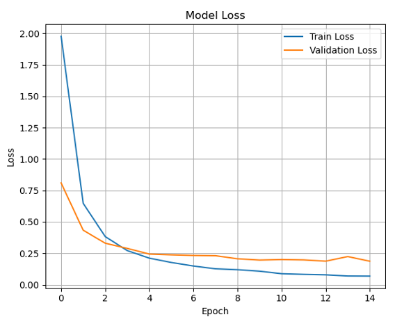
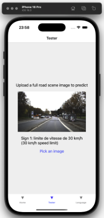

# Real-Time Translation of Road Signs App
React native mobile application used for detecting, classifying, and translating descriptions of road signs from an input image of a full road scene (refer to Figure 1). 

 
Figure 1: Example of a road scene image

 

**Notice**: System was coded in the Anaconda environment on a Macbook Pro M1, with 8gb RAM, on MacOS Sequoia (15.4.1). iPhone 16 Pro running iOS 18.3 was the primary mobile application simulator. No Windows testing has been done.

## About
Object detection achieved using a YOLOv8 model trained on the [GTSDB dataset](https://sid.erda.dk/public/archives/ff17dc924eba88d5d01a807357d6614c/published-archive.html). 
Road sign classification performed through a custom-built CNN model, trained on the [GTSRB dataset](https://www.kaggle.com/datasets/meowmeowmeowmeowmeow/gtsrb-german-traffic-sign) (refer to Figure 1 below). 
Road sign description translation provided by [LibreTranslate API](https://github.com/LibreTranslate/LibreTranslate). 

 
Figure 2: Architecture of the custom-built CNN model

## Results
<table align="center">
  <tr>
    <td align="center">
       
      Figure 3a: CNN model's accuracy results
    </td>
    <td align="center">
       
      Figure 3b: CNN model's loss results
    </td>
  </tr>
</table> 

 
Figure 4: Model application showing the translated description of detected road signs from a full road scene

## Setup
`git clone` this repository, it is recommended the folder this is cloned into has the name "**fyp-victoria-chan**". Renaming folders, unless specified, is discouraged as loading issues may occur when executing the full pipeline.

### Dataset preparation
No dataset is included in the repository due to folder sizes. Datasets are not required to run the program however they should be downloaded and renamed accordingly for model experimenting:
- [GTSDB](https://sid.erda.dk/public/archives/ff17dc924eba88d5d01a807357d6614c/published-archive.html) - download zip file "FullIJCNN2013.zip" & rename the folder to "**gtsdb-data**". If experimenting with YOLOv8, convert the dataset into YOLO format by running "**gtsdb_yolo.py**" (GTSDB is in PPM format which YOLOv8 does not accept).
- [GTSRB](https://www.kaggle.com/datasets/meowmeowmeowmeowmeow/gtsrb-german-traffic-sign) - download folders: "Meta", "Train", "Test" & their corresponding csv files. Place all downloads into one folder called "**gtsrb-data**"

Both folders should be placed into one folder called "**datasets**".  
Example: "**fyp-victoria-chan/datasets/gtsrb-data/**" should contain all the data downloaded from the Kaggle GTSRB dataset

### Dependencies
To download the dependencies, perform `pip install requirements.txt`

## Running the program
### On MacOS:
- Open terminal
- Go to the directory "fyp-victoria-chan" if the folder name isn't different
- Enter `./startup.sh`
- Do not click anything until the app is running

### On other OS:
- Due to unavailable access to other operating systems, the program has only been done on MacOS. It is recommended to run the program on a MacOS device with XCode and the iPhone simulator installed. 

## Understanding the directory
**Key files/folders:**
- datasets/ - all datasets
- py-files/ - all python scripts and backend related files
    - detection-results/ - all results from running "detection.py" are stored here
    - models/ - contains both the CNN and YOLOv8 models
    - cropping.py - crops road signs from full scenes
    - descriptions.py - dictionary mapping each class to a description
    - full_pipeline.py - when executed, runs the full backend pipeline (input, detection, cropping, classification, translation, output)
    - gtsdb_yolo.py - converts raw GTSDB data to YOLO format
    - gtsdb.yaml - used to train YOLOv8 model
    - lang_codes.md - full list of languages, and their associated language code, that are supported by LibreTranslate
    - load_data.py - load data from GTSRB to train or test CNN model
    - main.py - used to connect backend to frontend with Flask API
    - model.py - define the CNN architecture and compile parameters
    - testing.py - used to test the CNN model only
    - training.py - used to train the CNN model
    - translate.py - translates text into another language
- road-sign-translator/ - React + Expo mobile application
